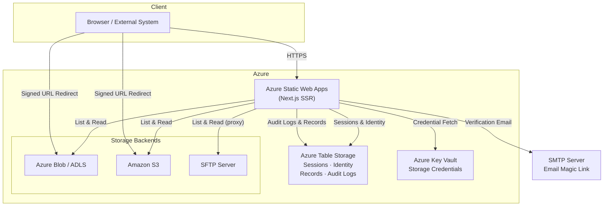
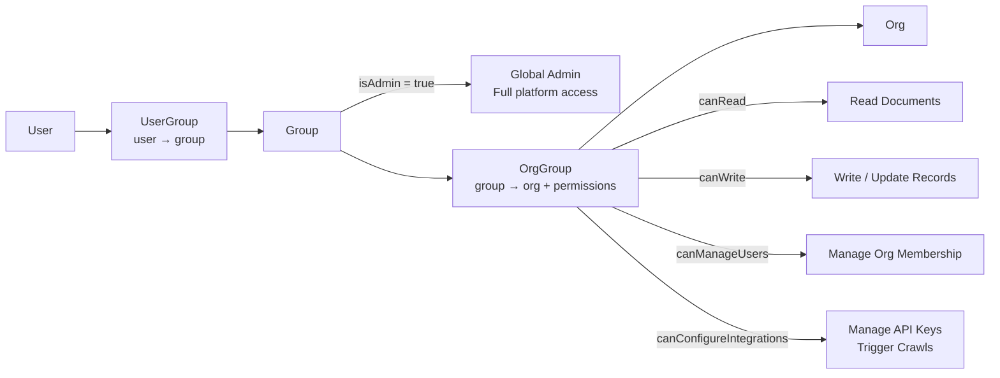
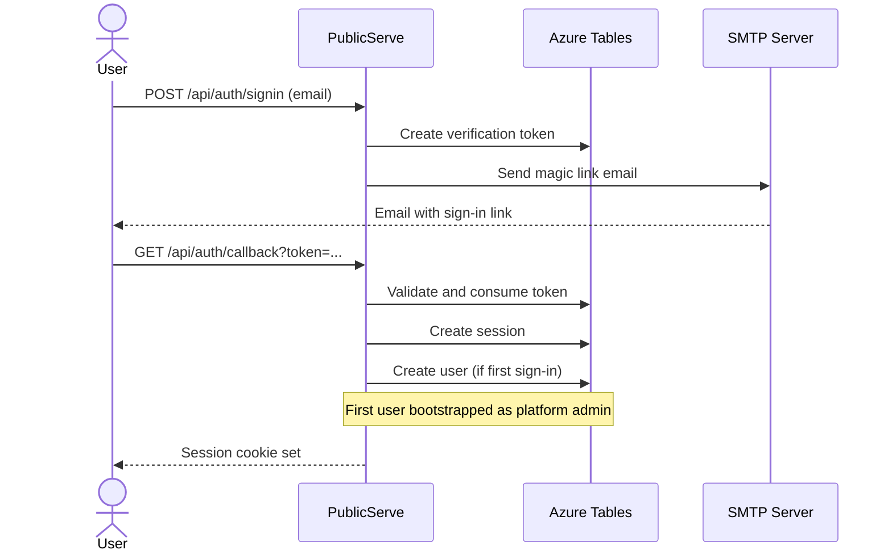
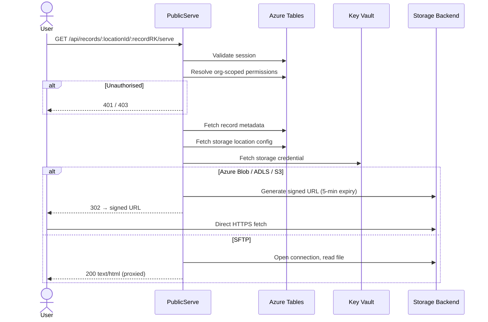
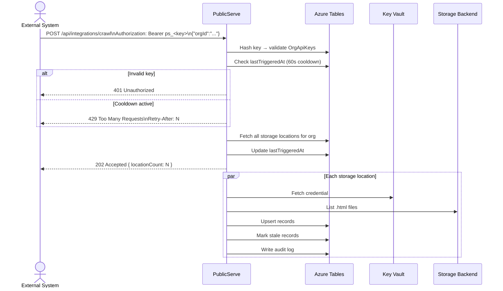

# PublicServe

[](https://github.com/thomasteoh/publicserve/actions/workflows/pr.yml)
[](https://github.com/thomasteoh/publicserve/actions/workflows/push-main.yml)
[](LICENSE)

A self-hostable, multi-tenant document serving platform. PublicServe crawls HTML artefacts from cloud storage — Azure Blob, Azure Data Lake Storage, Amazon S3, or SFTP — indexes them, and makes them securely accessible to authenticated users behind role-based access controls.

Built for enterprise teams that generate HTML reports, dashboards, and documentation and need a controlled, auditable way to share them internally without exposing cloud storage directly.

---

## Table of Contents

- [Design Philosophy](#design-philosophy)
- [Dependencies](#dependencies)
- [Architecture](#architecture)
- [Deployment](#deployment)
- [API Reference](#api-reference)
- [License](#license)

---

## Design Philosophy

**Azure-native, not Azure-locked.**
The primary infrastructure target is Azure (Tables, Key Vault, Static Web Apps), leveraging managed identity and platform-native services where possible. Storage backends are pluggable: Azure Blob, ADLS, S3, and SFTP are all first-class. Adding a new backend means implementing a small interface.

**Zero secrets in application code.**
Storage credentials are never hardcoded or stored in environment variables. They live in Azure Key Vault and are fetched at runtime on demand. The application holds no long-lived access to storage — credentials are fetched per operation.

**Audit-first.**
Every authentication event, document access, crawl operation, and permission denial is written to a structured audit log in Azure Tables. Logs are partitioned by category and date for efficient querying and long-term retention without additional tooling.

**Minimal indexing surface.**
Only `.html` files are indexed during crawls. This is deliberate: the platform is designed for serving rendered documents, not as a general-purpose file browser. A smaller index surface reduces noise and potential exposure.

**Email magic link, no OAuth dependencies.**
Authentication uses passwordless email (Nodemailer) backed by database sessions. No OAuth provider configuration is required. This suits environments where external identity providers are not available or desirable, and where email-based access control is sufficient.

**Role-based, organisation-scoped.**
Access control is modelled as users → groups → organisations → permissions. The first user to sign up is automatically bootstrapped as a platform administrator. Permissions are granular and org-scoped: a user can have read access to one organisation and configure-integrations access to another.

---

## Dependencies

All production dependencies are listed below with their purpose and enterprise/compliance rationale.

| Package | Version | Purpose | Justification |
|---|---|---|---|
| `next` | 16.x | Application framework (App Router, SSR, route handlers) | Industry-standard React framework. App Router enables server-side auth checks without client-side secret exposure. |
| `react` / `react-dom` | 19.x | UI rendering | Required by Next.js. React 19 includes server component improvements that reduce client bundle size. |
| `next-auth` | 5.x (beta) | Authentication and session management | The de-facto NextAuth library. v5 uses database sessions (not JWTs), making session revocation instantaneous. Supports the Azure Tables adapter pattern used here. |
| `nodemailer` | 7.x | Email delivery for magic link auth | Mature, widely audited Node.js email library. Requires no external SaaS email provider; works with any SMTP server including on-premises. |
| `@azure/data-tables` | 13.x | Azure Table Storage client | Official Microsoft SDK. Azure Tables provides cost-effective, scalable key-value storage without a relational database dependency. Used for all application state: sessions, identity, audit logs, document records. |
| `@azure/identity` | 4.x | Azure credential chain (`DefaultAzureCredential`) | Official Microsoft SDK. `DefaultAzureCredential` supports managed identity in Azure-hosted environments and falls back to CLI/env credentials for local development — no code changes between environments. |
| `@azure/keyvault-secrets` | 4.x | Azure Key Vault secret retrieval and storage | Official Microsoft SDK. Key Vault is the Azure-recommended secrets store, supports HSM-backed keys, full audit logging, and access policies. All storage credentials are stored here. |
| `@azure/storage-blob` | 12.x | Azure Blob and ADLS storage backend | Official Microsoft SDK. Used for listing, reading, and generating short-lived signed URLs for Azure Blob and Data Lake Storage Gen2 backends. |
| `@aws-sdk/client-s3` | 3.x | Amazon S3 storage backend | Official AWS SDK v3 (modular). Used for listing and reading S3 objects. |
| `@aws-sdk/client-sts` | 3.x | AWS STS for IAM role assumption | Required for `aws_iam_role` credential type. STS-based credential vending supports least-privilege, short-lived tokens without storing long-term AWS keys. |
| `@aws-sdk/s3-request-presigner` | 3.x | S3 pre-signed URL generation | Official AWS SDK module for generating time-limited signed URLs, allowing direct client access to S3 objects without proxying through the application. |
| `ssh2-sftp-client` | 12.x | SFTP storage backend | Connects to SFTP servers using password or private key authentication. Used when cloud storage signed URLs are not available; content is proxied server-side. |

### Dev Dependencies

| Package | Purpose |
|---|---|
| `vitest` | Unit and integration test runner (fast, native ESM, compatible mocking) |
| `@vitejs/plugin-react` | React support in Vitest |
| `@testing-library/react` | React component testing utilities |
| `jsdom` | Browser environment for component tests |
| `@playwright/test` | End-to-end browser tests |
| `typescript` | Static type checking |
| `eslint` + `eslint-config-next` | Linting with Next.js-specific rules |

---

## Architecture

### System Overview



### Identity and Permission Model



### Authentication Flow



### Document Serving Flow



### Crawl Trigger Flow (External Integration)



### Azure Table Schema

| Table | Partition Key | Row Key | Contains |
|---|---|---|---|
| `Users` | `"user"` | user UUID | Email, name, createdAt |
| `Accounts` | `account_{provider}_{id}` | user UUID | OAuth account links |
| `Sessions` | `"session"` | session token | userId, expires |
| `VerificationTokens` | `"verificationToken"` | `{email}_{token}` | Email magic link tokens |
| `Groups` | `"group"` | group UUID | name, isAdmin |
| `UserGroups` | user UUID | group UUID | addedAt, addedBy |
| `Orgs` | `"org"` | org UUID | name, createdAt |
| `OrgGroups` | org UUID | group UUID | canRead, canWrite, canManageUsers, canConfigureIntegrations |
| `StorageLocations` | org UUID | location UUID | name, type, rootPath, credentialRef |
| `OrgApiKeys` | org UUID | `"key"` | keyHash (SHA-256), keyPrefix, createdAt, lastTriggeredAt |
| `Records` | location UUID | SHA-256(locationId:path) | path, sizeBytes, lastModified, stale, lastCrawledAt |
| `AuditLogs` | `{category}#{YYYYMMDD}` | reverse-tick + random | category, level, message, timestamp, userId, orgId, metadata |

---

## Deployment

### Prerequisites

- Azure subscription with permission to create resource groups, storage accounts, Key Vaults, and Static Web Apps
- GitHub repository with Actions enabled
- Node.js LTS (22.x recommended)
- Terraform 1.7+
- Azure CLI

### 1. Bootstrap the CI/CD Service Principal

The bootstrap module runs once to create the service principal used by Terraform and GitHub Actions.

```bash
cd terraform/bootstrap
terraform init
terraform apply
```

Note the outputs: `client_id`, `client_secret`, `tenant_id`, `subscription_id`, `sp_object_id`.

### 2. Provision Infrastructure

```bash
cd terraform
terraform init

# Create and select your environment workspace
terraform workspace new nprod    # or: prod

# Set the service principal object ID in your tfvars
# nprod.tfvars / prod.tfvars:
#   sp_principal_id = "<sp_object_id from bootstrap>"

terraform apply -var-file="nprod.tfvars"
```

Resources created per environment:

| Resource | Name pattern |
|---|---|
| Resource Group | `rg-publicserve-{env}` |
| Azure Static Web App | `swa-publicserve-{env}` |
| Storage Account | Used for Azure Tables |
| Azure Key Vault | `kv-publicserve-{env}` |

### 3. Configure GitHub Secrets

The deploy workflow runs `terraform apply` and reads infrastructure outputs directly — you do not need to manually copy Terraform outputs into GitHub secrets. Only secrets that cannot be derived from Terraform need to be pre-configured.

Add the following secrets under **Settings → Secrets and variables → Actions**:

| Secret | Value |
|---|---|
| `ARM_CLIENT_ID` | Bootstrap service principal client ID |
| `ARM_CLIENT_SECRET` | Bootstrap service principal client secret |
| `ARM_TENANT_ID` | Azure tenant ID |
| `ARM_SUBSCRIPTION_ID` | Azure subscription ID |
| `AUTH_SECRET` | Random secret: `openssl rand -base64 32` |
| `SMTP_HOST` | SMTP server hostname |
| `SMTP_PORT` | SMTP port (default: `587`) |
| `SMTP_USER` | SMTP username |
| `SMTP_PASSWORD` | SMTP password or app password |
| `SMTP_FROM` | From address for auth emails |

The deploy workflow sources the following values from Terraform outputs automatically:

| Variable | Terraform output |
|---|---|
| `AZURE_STATIC_WEB_APPS_API_TOKEN` | `swa_api_key` |
| `AZURE_TABLES_CONNECTION_STRING` | `storage_connection_string` |
| `AZURE_KEYVAULT_URI` | `keyvault_uri` |
| `AUTH_URL` | `swa_hostname` (prefixed with `https://`) |

### 4. Deploy

Publishing a GitHub Release triggers the deploy workflow:

- Tags containing `rc` (e.g. `v1.2.0-rc1`) → deploys to `nprod`
- All other tags (e.g. `v1.2.0`) → deploys to `prod`

The workflow runs `terraform apply`, builds Next.js, and deploys to Azure Static Web Apps.

### 5. First Sign-In

Navigate to your SWA hostname and sign in with any email address. The first user to complete sign-in is automatically granted platform administrator access. No additional configuration is required.

### Local Development

```bash
npm install
```

Create `.env.local`:

```env
AUTH_SECRET=any-random-string
AUTH_URL=http://localhost:3000
AZURE_TABLES_CONNECTION_STRING=DefaultEndpointsProtocol=https;AccountName=...;AccountKey=...
AZURE_KEYVAULT_URI=https://your-vault.vault.azure.net/
SMTP_HOST=smtp.example.com
SMTP_PORT=587
SMTP_USER=user@example.com
SMTP_PASSWORD=your-password
SMTP_FROM=noreply@example.com
```

```bash
npm run dev        # http://localhost:3000
npm test           # unit tests
npm run test:e2e   # end-to-end tests (requires running app)
```

### Adding Storage Credentials to Key Vault

Each storage location has a `credentialRef` of the form `storage-cred-{locationId}`. Store credentials as JSON secrets:

```bash
# Azure Blob — storage key
az keyvault secret set \
  --vault-name kv-publicserve-prod \
  --name "storage-cred-<locationId>" \
  --value '{"type":"storage_key","accountKey":"<key>"}'

# Azure Blob / ADLS — managed identity
az keyvault secret set \
  --vault-name kv-publicserve-prod \
  --name "storage-cred-<locationId>" \
  --value '{"type":"managed_identity"}'

# Azure — service principal
az keyvault secret set \
  --vault-name kv-publicserve-prod \
  --name "storage-cred-<locationId>" \
  --value '{"type":"service_principal","clientId":"...","clientSecret":"...","tenantId":"..."}'

# S3 — access key
az keyvault secret set \
  --vault-name kv-publicserve-prod \
  --name "storage-cred-<locationId>" \
  --value '{"type":"aws_access_key","accessKeyId":"AKIA...","secretAccessKey":"...","region":"us-east-1","bucket":"my-bucket"}'

# S3 — IAM role
az keyvault secret set \
  --vault-name kv-publicserve-prod \
  --name "storage-cred-<locationId>" \
  --value '{"type":"aws_iam_role","roleArn":"arn:aws:iam::...","region":"us-east-1","bucket":"my-bucket"}'

# SFTP — password
az keyvault secret set \
  --vault-name kv-publicserve-prod \
  --name "storage-cred-<locationId>" \
  --value '{"type":"sftp_password","host":"sftp.example.com","port":22,"username":"user","password":"pass"}'

# SFTP — private key
az keyvault secret set \
  --vault-name kv-publicserve-prod \
  --name "storage-cred-<locationId>" \
  --value '{"type":"sftp_key","host":"sftp.example.com","port":22,"username":"user","privateKey":"-----BEGIN..."}'
```

---

## API Reference

### Authentication

All API routes use one of two authentication methods:

- **Session** — cookie set by NextAuth after email sign-in. Required for all user-facing routes.
- **Bearer** — `Authorization: Bearer ps_<key>` header. Used only for the external crawl trigger.

---

### Admin Logs

#### `GET /api/admin/logs`

> Auth: session · Permission: `isAdmin`

Query the platform audit log.

**Query parameters:**

| Parameter | Description |
|---|---|
| `category` | `auth` \| `crawl` \| `serve` \| `permission_denied` \| `storage_error` |
| `from` | Start date `YYYY-MM-DD` (inclusive) |
| `to` | End date `YYYY-MM-DD` (inclusive) |
| `cursor` | Pagination cursor from previous response |

**Response `200`:**
```json
{
  "entries": [
    {
      "rowKey": "9007199250000000-a1b2c3d4",
      "category": "crawl",
      "level": "info",
      "message": "crawl completed",
      "timestamp": "2026-04-29T10:00:00.000Z",
      "userId": "user-uuid",
      "orgId": "org-uuid",
      "metadata": "{\"added\":12,\"updated\":3,\"stale\":0}"
    }
  ],
  "nextCursor": "20260429_0_9007199250000000-a1b2c3d4"
}
```

`nextCursor` is `null` when no further pages exist. Pass it as `cursor` to load the next page.

---

### API Key Management

#### `GET /api/orgs/:orgId/api-key`

> Auth: session · Permission: `canConfigureIntegrations` or `isAdmin`

Returns current API key metadata. Returns `404` if no key has been generated.

**Response `200`:**
```json
{
  "keyPrefix": "ps_1a2b3c4d",
  "createdAt": "2026-04-29T10:00:00.000Z",
  "createdBy": "user-uuid",
  "lastTriggeredAt": "2026-04-29T11:30:00.000Z"
}
```

#### `POST /api/orgs/:orgId/api-key`

> Auth: session · Permission: `canConfigureIntegrations` or `isAdmin`

Generates a new API key. Rotates the existing key if one is present — the previous key stops working immediately. The raw key is returned **once only** and cannot be retrieved again.

**Response `201`:**
```json
{
  "rawKey": "ps_1a2b3c4d5e6f7a8b9c0d1e2f3a4b5c6d7e8f9a0b1c2d3e4f5a6b7c8d9e0f1a2b",
  "keyPrefix": "ps_1a2b3c4d",
  "createdAt": "2026-04-29T10:00:00.000Z"
}
```

#### `DELETE /api/orgs/:orgId/api-key`

> Auth: session · Permission: `canConfigureIntegrations` or `isAdmin`

Revokes the current API key. Returns `204 No Content`.

---

### Crawl Management

#### `POST /api/orgs/:orgId/storage-locations/:locationId/crawl`

> Auth: session · Permission: `canConfigureIntegrations` or `isAdmin`

Triggers a synchronous crawl of a single storage location. Blocks until the crawl is complete.

**Response `200`:**
```json
{
  "added": 12,
  "updated": 3,
  "stale": 1,
  "unchanged": 47
}
```

#### `POST /api/integrations/crawl`

> Auth: Bearer API key

Triggers an asynchronous crawl of all storage locations for an organisation. Returns immediately; crawls run in parallel in the background.

**Rate limit:** 60 seconds per organisation. Enforced via `lastTriggeredAt` on the API key record.

**Request:**
```http
POST /api/integrations/crawl
Authorization: Bearer ps_<key>
Content-Type: application/json

{
  "orgId": "org-uuid"
}
```

**Response `202`:**
```json
{
  "orgId": "org-uuid",
  "locationCount": 3
}
```

**Errors:**

| Status | Condition |
|---|---|
| `400` | Missing or empty `orgId` |
| `401` | Missing, malformed, or invalid bearer token |
| `404` | Organisation not found |
| `422` | Organisation has no storage locations |
| `429` | Rate limit exceeded — `Retry-After: <seconds>` header included |

---

### Document Serving

#### `GET /api/records/:locationId/:recordRK/serve`

> Auth: session · Permission: `canRead` or `isAdmin`

Serves a document. For Azure Blob, ADLS, and S3 backends, issues a redirect to a short-lived signed URL (5-minute expiry). For SFTP backends, proxies the content through the server.

**Response `302`** (cloud backends):
```
Location: https://storage.blob.core.windows.net/container/path/report.html?sv=...&sig=...
```

**Response `200`** (SFTP backends):
```
Content-Type: text/html

<html>...</html>
```

**Errors:**

| Status | Condition |
|---|---|
| `401` | No valid session |
| `403` | Insufficient permissions |
| `404` | Record or storage location not found |
| `500` | Storage read failure (logged as `storage_error`) |

---

## License

MIT License

Copyright (c) PublicServe Contributors

Permission is hereby granted, free of charge, to any person obtaining a copy of this software and associated documentation files (the "Software"), to deal in the Software without restriction, including without limitation the rights to use, copy, modify, merge, publish, distribute, sublicense, and/or sell copies of the Software, and to permit persons to whom the Software is furnished to do so, subject to the following conditions:

The above copyright notice and this permission notice shall be included in all copies or substantial portions of the Software.

THE SOFTWARE IS PROVIDED "AS IS", WITHOUT WARRANTY OF ANY KIND, EXPRESS OR IMPLIED, INCLUDING BUT NOT LIMITED TO THE WARRANTIES OF MERCHANTABILITY, FITNESS FOR A PARTICULAR PURPOSE AND NONINFRINGEMENT. IN NO EVENT SHALL THE AUTHORS OR COPYRIGHT HOLDERS BE LIABLE FOR ANY CLAIM, DAMAGES OR OTHER LIABILITY, WHETHER IN AN ACTION OF CONTRACT, TORT OR OTHERWISE, ARISING FROM, OUT OF OR IN CONNECTION WITH THE SOFTWARE OR THE USE OR OTHER DEALINGS IN THE SOFTWARE.
